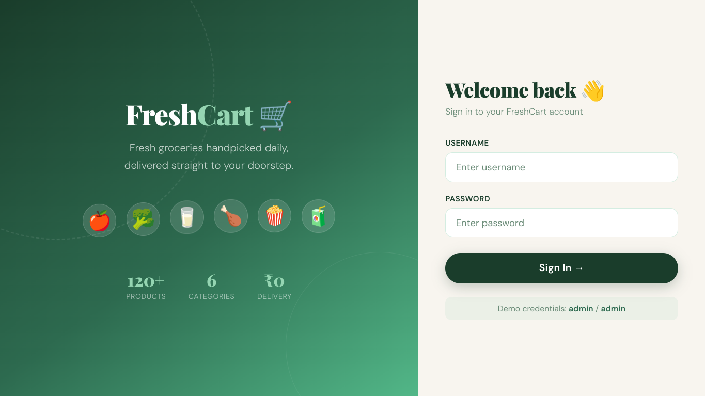
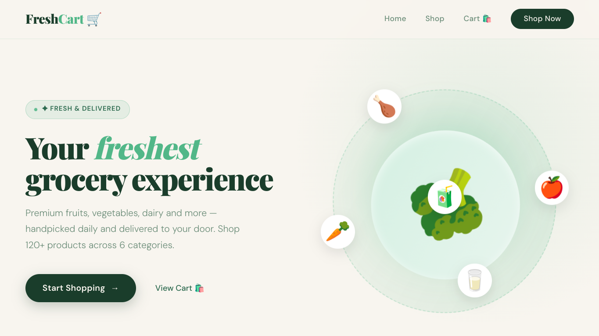
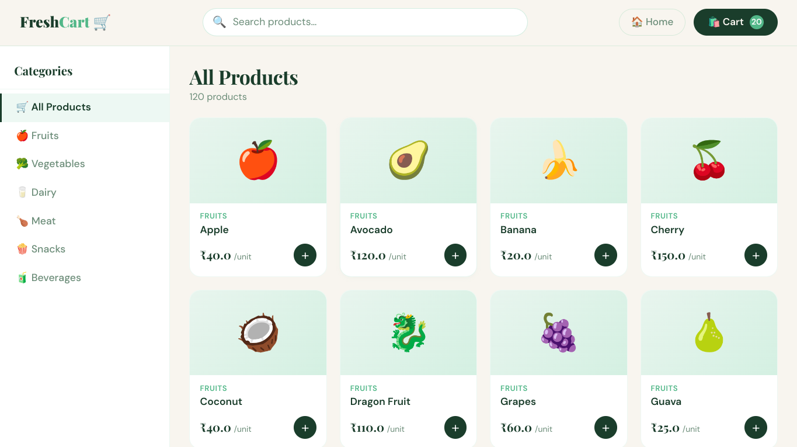
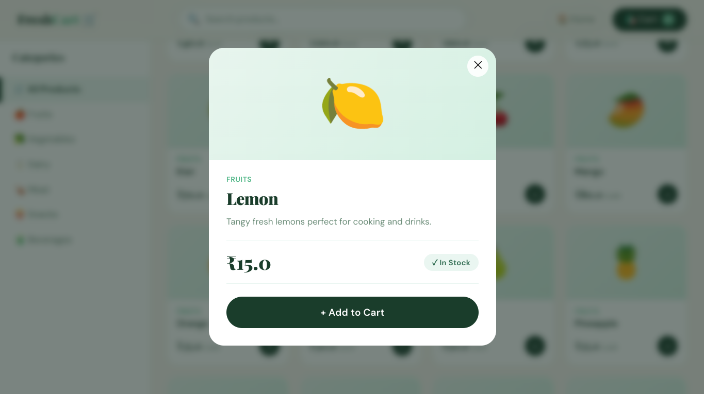
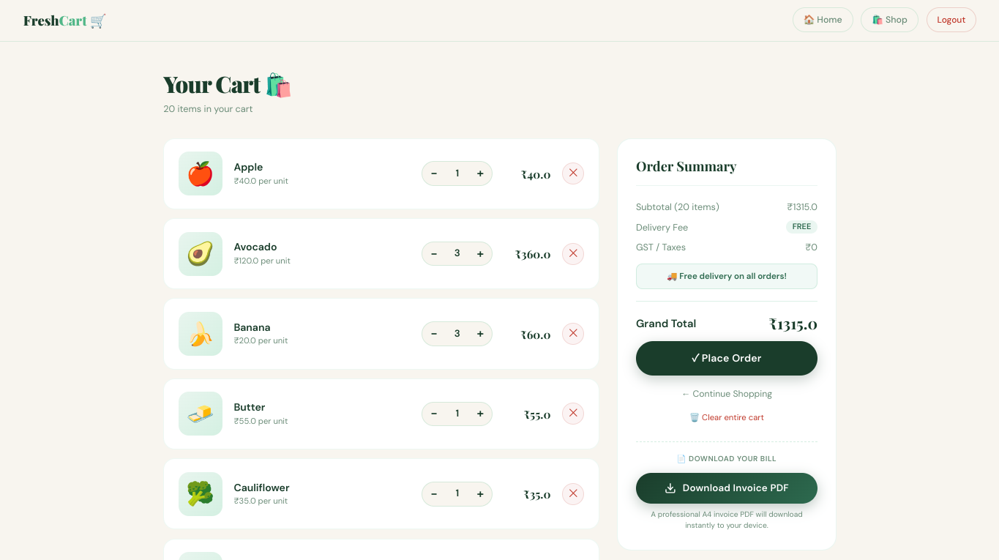
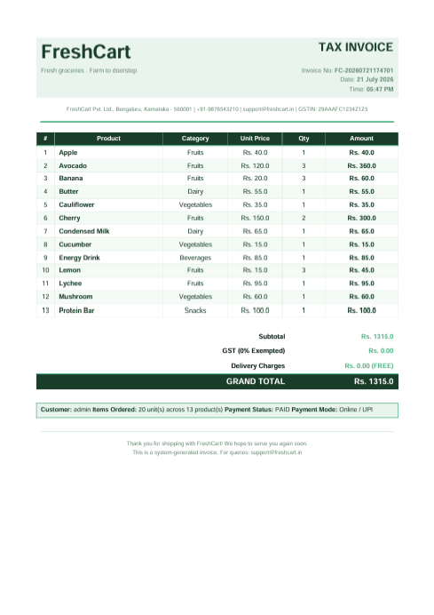

# FreshCart - Grocery Management System

## About the Project

FreshCart is a grocery shopping web application developed using Flask and SQLite.
It allows users to browse grocery items, add products to a shopping cart, place orders, and generate invoices. This project was built to practice backend development, database management, and web application development using Python.

## Features

- User login
- Browse products by category
- Add and remove items from the cart
- Update product quantity
- Place orders
- Generate PDF invoices
- User dashboard
- Custom error page
- Health check and version endpoints

## Technologies Used

- Python
- Flask
- SQLite
- HTML
- CSS
- JavaScript
- ReportLab

## Project Structure

app.py
templates/
static/
freshcart.db
requirements.txt

## Planned Improvements

- Add a search option to find products quickly
- Improve the dashboard with more useful information
- Allow users to view their previous orders
- Add favourite products
- Support online payments
- Improve the design for mobile devices
- Add product ratings and reviews
- Notify users after placing an order
- Show stock availability for products

## How to Run

1. Clone the repository.
2. Install the required packages using:
pip install -r requirements.txt
3. Start the application:
python3 app.py
4. Open the application in your browser.

## Author

Developed by **Syed Owes Jaleel** as a personal learning project.

## Screenshots

### Login

### Dashboard

### Products

### Product Details

### Shopping Cart

### Invoice

